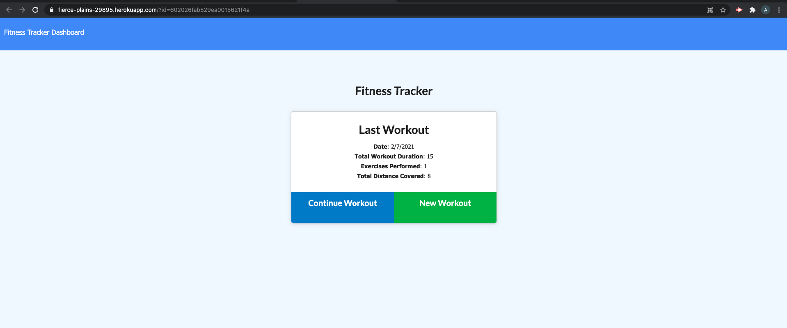

# 
 Workout Tracker 

## Description
This workout app is useful for any interested consumer, as a user will reach their fitness goals more quickly when they track their workout progress. This app allows a user to view, create, and track daily workouts. A user is able to log multiple exercises in a workout on a given day. The user can also track the name, type, weight, sets, reps, and duration of exercise. If the workout is a cardio exercise, the user can track their total distance traveled.

The user's workout data is displayed in a clean and appealing dashboard that includes pie charts and graphs.

## Table of Contents
* [Description](#Description)
* [Built With](#built-with)
* [Demo](#demo)
* [Authors](#authors)
* [License](#license)

## Built With
* HTML
* CSS
* Javascript
* Node.js
* Mongodb
* Mongoose
* Express 

## Demo
Click this link to see the full app deployed with heroku. 

* https://fierce-plains-29895.herokuapp.com/

* Screenshot of application 

## Authors
Alma Aziz

## MIT License

Copyright (c) 2021 Ayanna Aziz

Permission is hereby granted, free of charge, to any person obtaining a copy
of this software and associated documentation files (the "Software"), to deal
in the Software without restriction, including without limitation the rights
to use, copy, modify, merge, publish, distribute, sublicense, and/or sell
copies of the Software, and to permit persons to whom the Software is
furnished to do so, subject to the following conditions:

The above copyright notice and this permission notice shall be included in all
copies or substantial portions of the Software.

THE SOFTWARE IS PROVIDED "AS IS", WITHOUT WARRANTY OF ANY KIND, EXPRESS OR
IMPLIED, INCLUDING BUT NOT LIMITED TO THE WARRANTIES OF MERCHANTABILITY,
FITNESS FOR A PARTICULAR PURPOSE AND NONINFRINGEMENT. IN NO EVENT SHALL THE
AUTHORS OR COPYRIGHT HOLDERS BE LIABLE FOR ANY CLAIM, DAMAGES OR OTHER
LIABILITY, WHETHER IN AN ACTION OF CONTRACT, TORT OR OTHERWISE, ARISING FROM,
OUT OF OR IN CONNECTION WITH THE SOFTWARE OR THE USE OR OTHER DEALINGS IN THE
SOFTWARE.